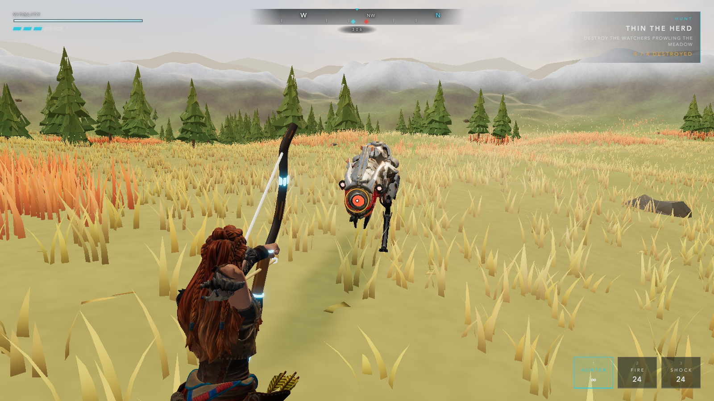
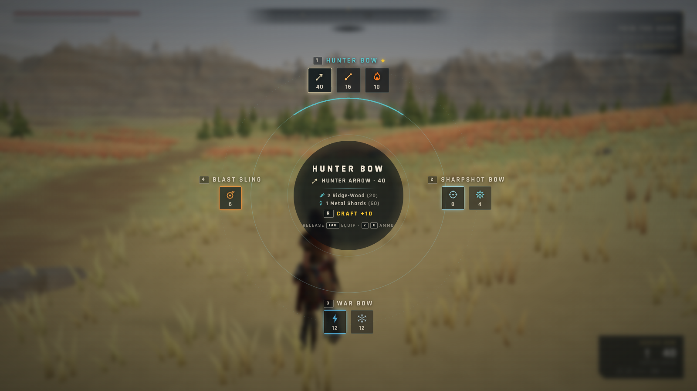
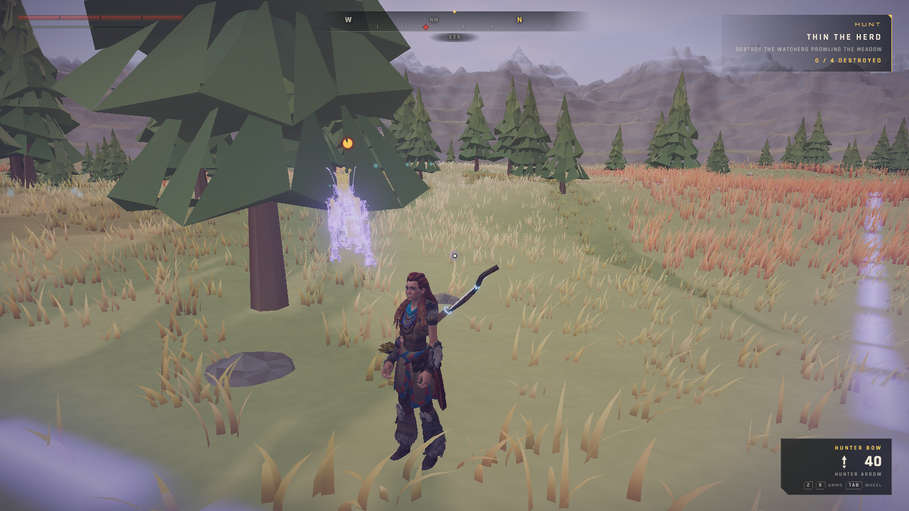
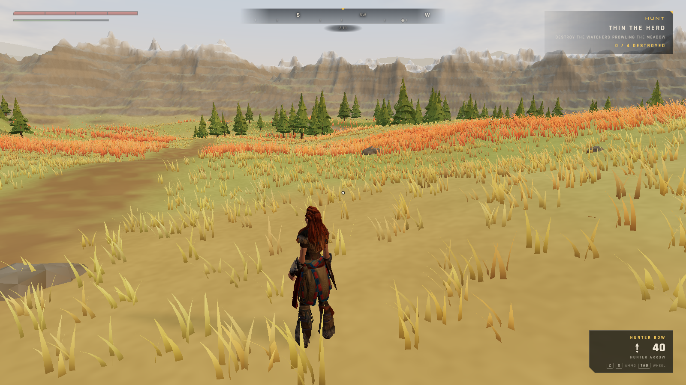
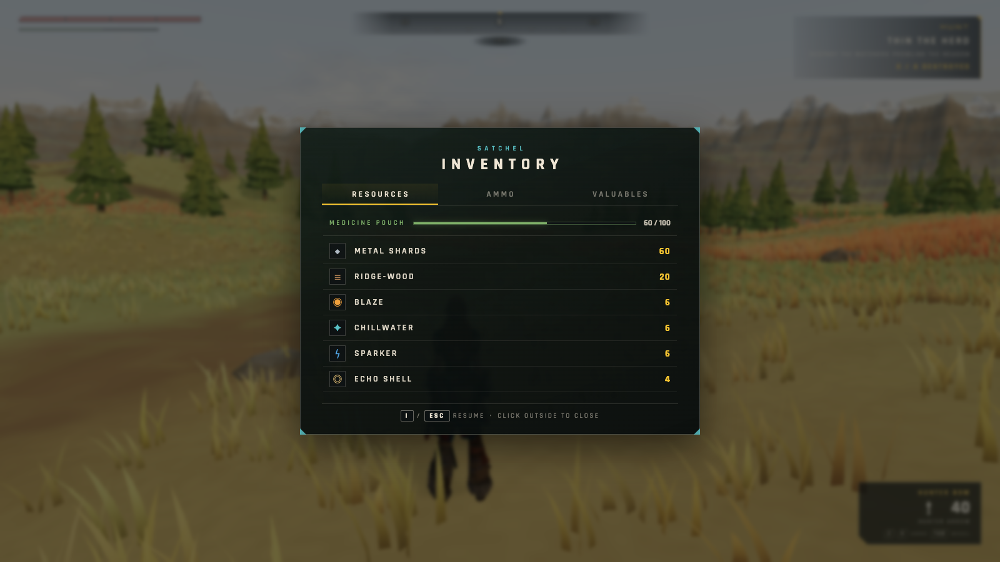
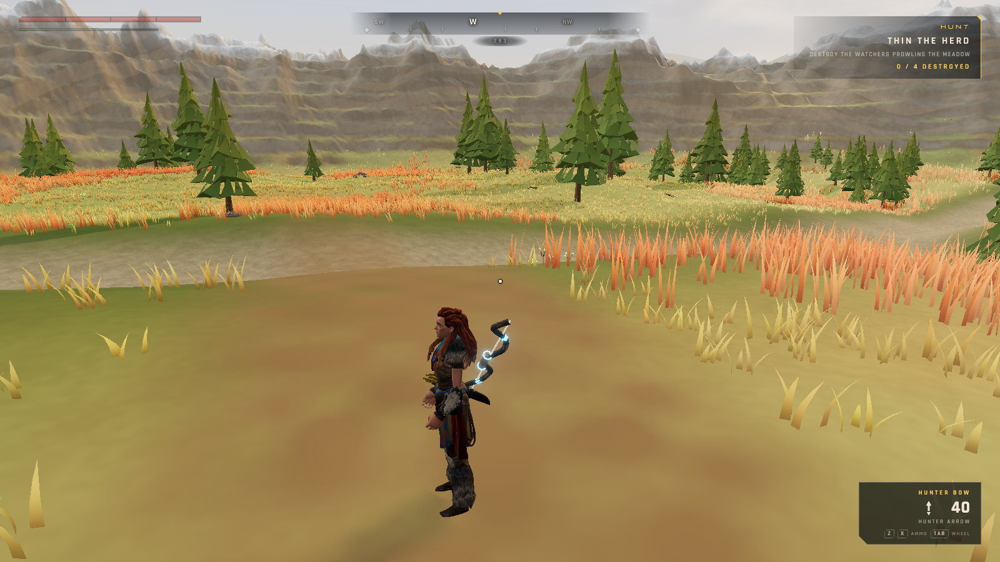
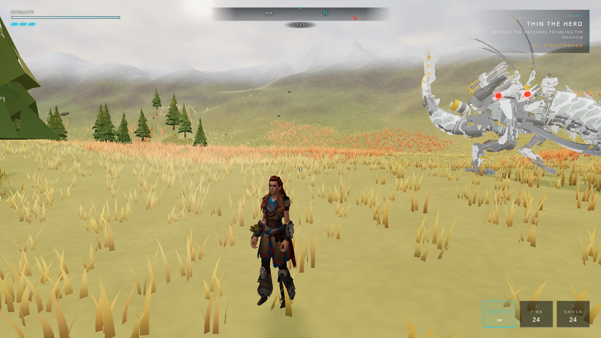

# HORIZON ZERO CLAUDE

A browser-native, third-person robot-dinosaur hunting game in the spirit of
*Horizon Zero Dawn* — built end-to-end by Claude using the
[Gauntlet Loop](https://somethingbig.ai/gauntlet-loop) methodology: parallel
builder agents, adversarial critic agents, and concrete reference standards
("does this look like HZD, or a programmer demo?") iterated until it passes.



## Play

```bash
npm install
npm run dev        # http://localhost:5173
```

| Input | Action |
|---|---|
| WASD · Shift | Move · Sprint |
| C | Crouch (stealth in tall grass) |
| Space / LCtrl | Dodge roll |
| RMB · LMB | Aim · Draw / loose |
| Shift (aiming) | Concentration (slow-mo gauge) |
| Tab (hold) | Weapon wheel — time slows, craft ammo with R |
| 1–4 · Z/X | Weapon quick-slots · cycle ammo |
| V · T | Focus toggle · tag machine |
| E (hold) | Interact — loot, gather herbs & ridge-wood |
| Q (hold) | Medicine pouch → health |
| R · I · Esc | Craft ammo · inventory · pause |

**The hunt:** clear the valley — 4 Watchers, 2 Sawtooths, the Behemoth, and
finally the Thunderjaw in the southern wastes. Freeze it brittle, tearblast
its disc launchers off, then pick one up and kill it with its own gun.

## What's inside

- **Three.js + Vite**, no game engine, no frameworks.
- Six Sketchfab GLB models (435 MB raw) crunched to ~22 MB via
  `gltf-transform` (meshopt + quantization + WebP), `npm run optimize`.
- **Procedural animation** — the models shipped with zero animation clips.
  Aloy's locomotion (banked turns, plant-and-turn, exertion breathing,
  quiver-flourish nock, dodge roll), the Watcher's walk/neck-scan, and the
  death crumples are all runtime bone posing; the big machines move with
  root-motion + procedural sway.
- **Component damage** — every machine carries tearable parts at canon
  locations (blaze canisters that explode, force loaders that gate attacks,
  the Thunderjaw's radar/jaw cannons/disc launchers) with three damage
  channels: impact, tear, and elemental buildup (burn / stun / freeze-brittle).
  Torn parts fall with physics and can be looted — or picked up and fired.
- **Real HZD systems, from research** (`docs/research/`): 4 weapons × 8 ammo
  types with the canon crafting economy, hold-Tab weapon wheel with time-slow,
  Concentration gauge, medicine pouch (hold Q), Focus with component
  highlights / patrol paths / info cards / tagging, satchel inventory,
  gatherable herbs and ridge-wood, and the 2020 PC port's keybinds.
- Terraced badlands terrain with a dried river, worn trails, and 2M+ blades
  of wind-swaying instanced grass; bundled OFL fonts (Michroma/Rajdhani);
  fully procedural WebAudio soundscape (not a single audio file).
- A puppeteer screenshot harness (`npm run shot`) that the builder/critic
  agents used to judge their own work — the gauntlet loop's eyes.

## Gallery

| | |
|---|---|
|  |  |
|  |  |
|  |  |

## How it was built (the Gauntlet Loop)

1. **Scaffold** — asset pipeline, engine, terrain, player controller, and a
   puppeteer screenshot harness so agents can *see* their work.
2. **Build fleet** — 7 parallel builder agents (vegetation, camp, animation,
   machines, combat, HUD, audio), each iterating build → screenshot →
   self-critique against the spec's interface contracts.
3. **Critic fleet** — 6 adversarial critics (world, character, machines,
   combat/HUD, QA torture-testing, static code review) hunting for anything
   that "reads as a programmer demo" vs HZD stills — with instrumented
   measurements (bone-to-terrain distances, draw calls, state-machine probes).
4. **Fix fleet** — 6 fixers applying every finding, verified numerically
   (foot contact ±5mm, standoff distances, weak-point hit resolution).
5. **Verify fleet** — final re-critique: SHIP/HOLD per dimension, last two
   HOLDs fixed by hand, re-verified.

## Credits

Models from Sketchfab (Aloy Fortnite rig, Redeye Watcher rig, Sawtooth,
Thunderjaw, Behemoth scans, HZD character fanart) — used here as fan-art in a
non-commercial tech demo. Horizon Zero Dawn is © Guerrilla Games / Sony
Interactive Entertainment; this project is an unaffiliated homage.

Round 3 machine-variety models (see models-staging/MANIFEST.md for full manifest):

- "Mechanical Horse" by jake young — [Poly Pizza](https://poly.pizza/m/d4bayjeM1aD), CC-BY 3.0 (Strider)
- "Robocat" by Jordan Hill — [Poly Pizza](https://poly.pizza/m/d78wyEWCmTC), CC-BY 3.0 (Scrapper)
- "Robot Enemy Flying" and Ultimate Monsters pack by [Quaternius](https://quaternius.com) — CC0
  (Glinthawk, Longleg)
- Fox rig reference — Khronos glTF-Sample-Assets, CC0/CC-BY 4.0

Round 4 machine-expansion donors (see `models-staging/MANIFEST.md` and
`docs/research/casting-v4.md` §0; rebuild with `node tools/bake-rigs.mjs`).
**CC-BY 3.0 — attribution required:**

- "Black Caiman" by Poly by Google — [Poly Pizza](https://poly.pizza/m/5etIv4omd7Z), CC-BY 3.0 (Snapmaw)
- "Lion" by Poly by Google — [polygone.art](https://polygone.art/model/cC_IFclYA4c), CC-BY 3.0 (Ravager)
- "Scorpion" by Poly by Google — [Poly Pizza](https://poly.pizza/m/6Bu7d_Pkm5o), CC-BY 3.0 (Corruptor)
- "Hawk (low-poly, rigged)" by Sherkiz — [Poly Pizza](https://poly.pizza/m/RkN6MEbP6g), CC-BY 3.0 (Stormbird)

CC0 1.0 (courtesy credit): "Bull" and "Deer" from the Ultimate Animated Animals
pack and "Spider" by [Quaternius](https://quaternius.com) (Broadhead, Grazer,
Shell-Walker). The pack's "Apatosaurus" was staged as a Tallneck donor and is
not shipped — no Tallneck species was built, so the model is not loaded.

The Lion, Spider and Hawk donors are retired under authored shells
(`hideSculpt`); their attribution stands because the files are still in the
repository and were used to derive the rigs.
- Julius Sans One typeface — LatinoType, SIL Open Font License (wordmark/display)

🤖 Built with [Claude Code](https://claude.com/claude-code)
